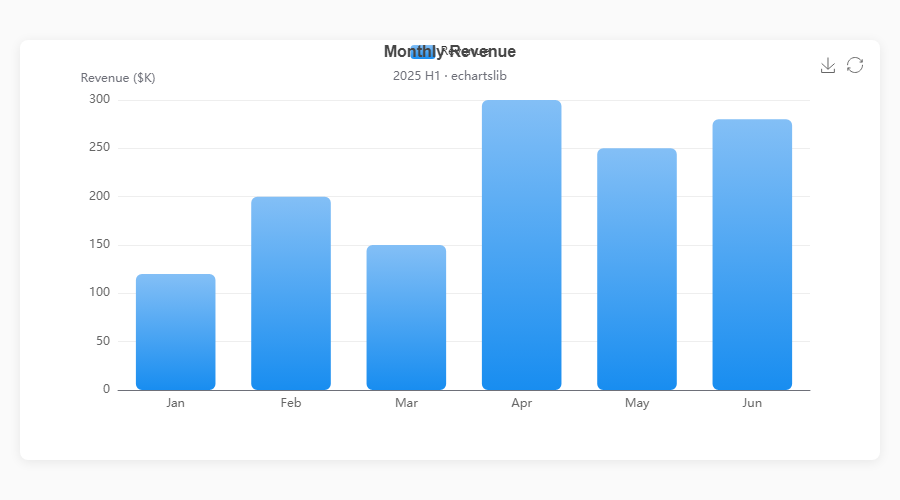
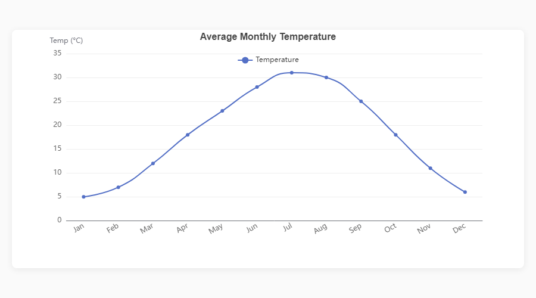
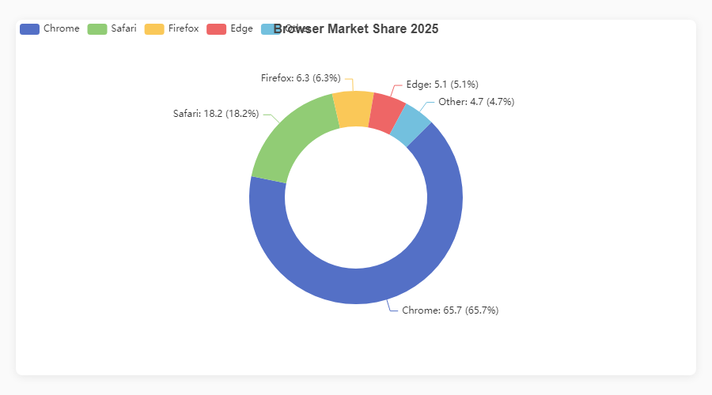
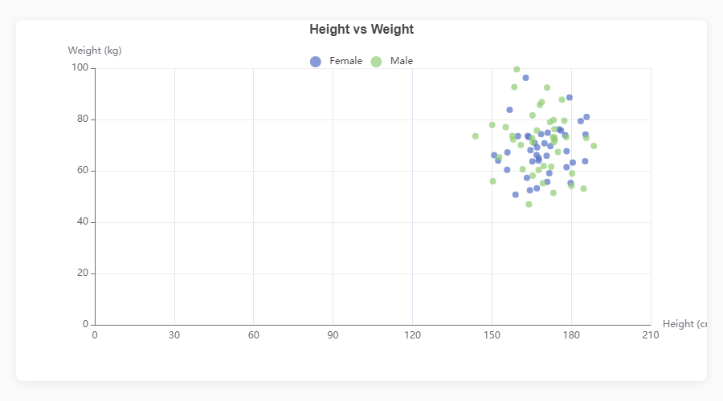
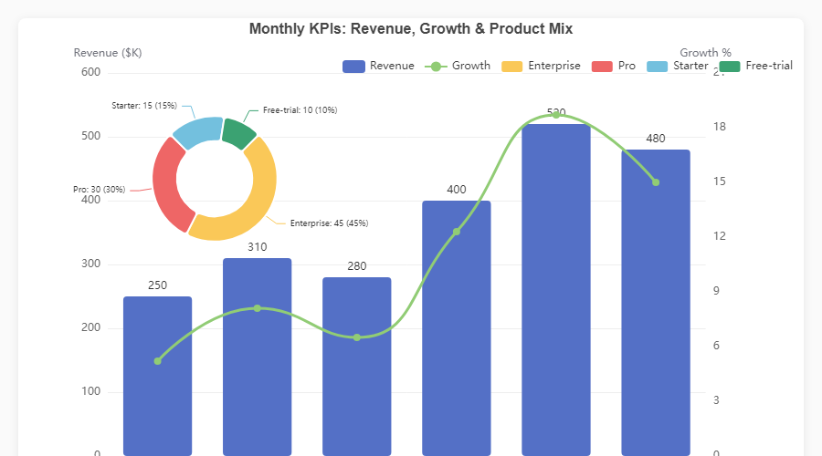
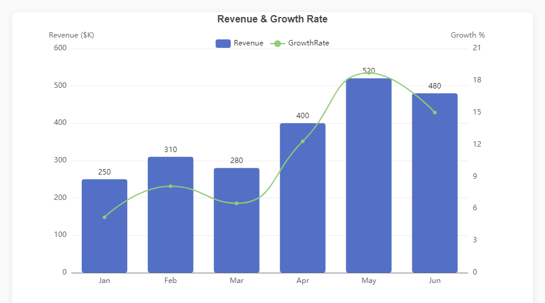
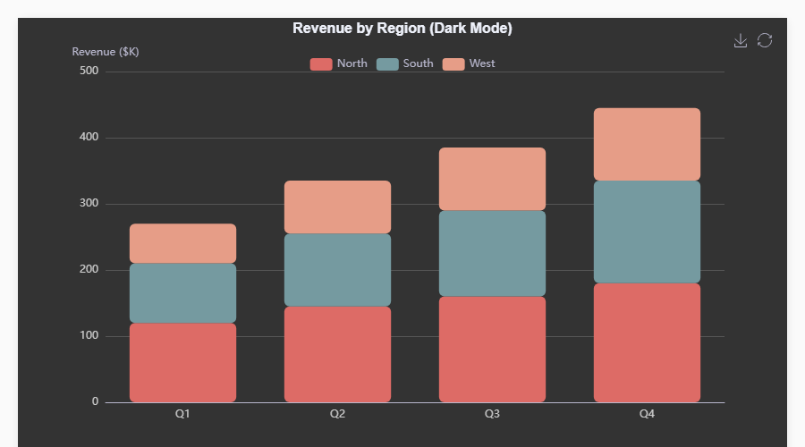
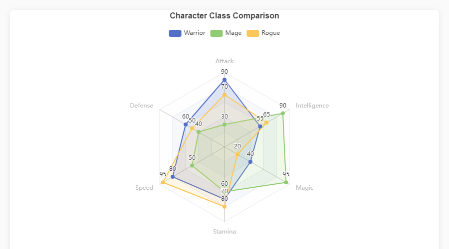
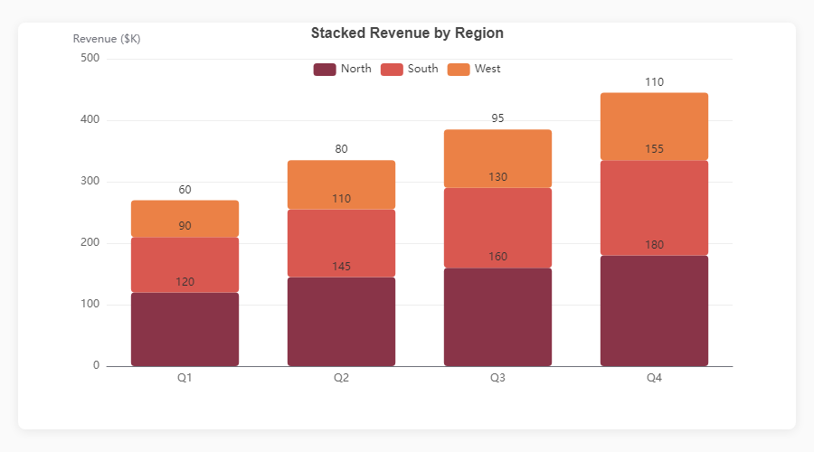
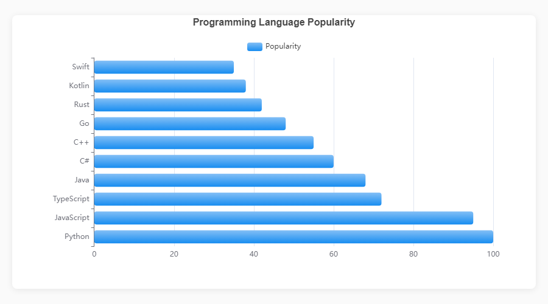

<p align="center">
  
</p>

<h1 align="center">echartslib</h1>

<p align="center">
  <strong>A matplotlib-style fluent builder API for <a href="https://echarts.apache.org/">Apache ECharts</a> in Python.</strong>
</p>

<p align="center">
  <a href="https://pypi.org/project/echartslib/"></a>
  <a href="https://pypi.org/project/echartslib/"></a>
  <a href="https://github.com/astrojigs/echartslib/blob/main/LICENSE"></a>
  <a href="https://github.com/astrojigs/echartslib/stargazers"></a>
</p>

<p align="center">
  Build interactive, publication-quality charts with a familiar<br/>
  <code>fig = figure()</code> → <code>fig.bar()</code> → <code>fig.show()</code> workflow.<br/>
  Works in <b>Jupyter Notebooks</b>, <b>Streamlit</b> apps, and <b>standalone Python scripts</b>.
</p>

---

## Showcase

<table>
<tr>
<td width="50%">
<p align="center"><strong>Gradient Bar Chart</strong></p>
<p align="center"></p>
</td>
<td width="50%">
<p align="center"><strong>Multi-Line with Area</strong></p>
<p align="center"></p>
</td>
</tr>
<tr>
<td width="50%">
<p align="center"><strong>Donut Chart</strong></p>
<p align="center"></p>
</td>
<td width="50%">
<p align="center"><strong>Scatter Plot</strong></p>
<p align="center"></p>
</td>
</tr>
<tr>
<td width="50%">
<p align="center"><strong>Composite: Bar + Pie Overlay</strong></p>
<p align="center"></p>
</td>
<td width="50%">
<p align="center"><strong>Dual-Axis: Bar + Line</strong></p>
<p align="center"></p>
</td>
</tr>
<tr>
<td width="50%">
<p align="center"><strong>Dark Theme</strong></p>
<p align="center"></p>
</td>
<td width="50%">
<p align="center"><strong>Radar Chart</strong></p>
<p align="center"></p>
</td>
</tr>
<tr>
<td width="50%">
<p align="center"><strong>Stacked Bar</strong></p>
<p align="center"></p>
</td>
<td width="50%">
<p align="center"><strong>Horizontal Bar</strong></p>
<p align="center"></p>
</td>
</tr>
</table>

> All charts are fully interactive — hover, zoom, and download built in. See the [live HTML demos](assets/) or run `python generate_demos.py` to generate them yourself.

---

## Installation

```bash
pip install echartslib
```

With optional extras:

```bash
pip install echartslib[jupyter]     # Jupyter Notebook support
pip install echartslib[streamlit]   # Streamlit support
pip install echartslib[scipy]       # KDE density plots
pip install echartslib[all]         # Everything
```

---

## Quick Start

```python
import pandas as pd
import echartslib as ec

ec.config(engine="jupyter")  # or "python" or "streamlit"

df = pd.DataFrame({
    "Month": ["Jan", "Feb", "Mar", "Apr", "May"],
    "Revenue": [120, 200, 150, 300, 250],
})

fig = ec.figure(height="400px")
fig.bar(df, x="Month", y="Revenue", border_radius=6, gradient=True)
fig.title("Monthly Revenue")
fig.ylabel("Revenue ($K)")
fig.show()
```

That's it. Three lines to go from DataFrame to interactive chart.

---

## Rendering Engines

| Engine | Use Case | Setup |
|:---|:---|:---|
| `"jupyter"` | Jupyter Notebook / JupyterLab | `pip install echartslib[jupyter]` |
| `"python"` | Standalone scripts → opens browser | No extra deps |
| `"streamlit"` | Streamlit applications | `pip install echartslib[streamlit]` |

```python
ec.config(engine="jupyter")
ec.config(engine="jupyter", adaptive="dark")   # Force dark mode
ec.config(engine="jupyter", adaptive="light")  # Force light mode
```

---

## Chart Types

### Cartesian Charts

```python
# Bar — stacked, horizontal, gradient fills
fig.bar(df, x="Month", y="Revenue", hue="Region", stack=True, gradient=True, orient="h")

# Line — smooth curves, filled areas, multi-series via hue
fig.plot(df, x="Month", y="Sales", hue="Region", smooth=True, area=True)

# Scatter — color & size encoding
fig.scatter(df, x="Height", y="Weight", color="Gender", size="Age")

# Histogram — auto-binned distribution
fig.hist(df, column="Score", bins=20)

# Boxplot — statistical summary
fig.boxplot(df, x="Department", y="Salary")

# KDE — kernel density estimation (requires scipy)
fig.kde(df, column="Score", hue="Class")
```

### Standalone Charts

```python
# Pie / Donut
fig.pie(df, names="Browser", values="Share", inner_radius="40%")

# Radar
fig.radar(indicators, data)

# Heatmap
fig.heatmap(df, x="Day", y="Hour", value="Count")

# Sankey
fig.sankey(df, levels=["Source", "Target"], value="Flow")

# Treemap
fig.treemap(df, path=["Group", "Item"], value="Count")

# Funnel
fig.funnel(df, names="Stage", values="Count")
```

---

## Composite Charts

Overlay a pie chart on a bar/line figure — no raw JSON needed:

```python
fig = ec.figure(height="500px")
fig.bar(df, x="Dept", y="Budget", gradient=True)
fig.pie(df, names="Dept", values="Budget",
        center=["82%", "25%"], radius=["18%", "28%"],
        label_font_size=9)
fig.show()
```

---

## Dual-Axis Charts

```python
fig = ec.figure()
fig.bar(df, x="Month", y="Revenue")
fig.plot(df, x="Month", y="Growth", axis=1, smooth=True)
fig.ylabel("Revenue ($K)")
fig.ylabel_right("Growth (%)")
fig.show()
```

---

## Timeline Animations

Animate any chart across a time dimension:

```python
fig = ec.TimelineFigure(height="500px", interval=1.5)
fig.bar(df, x="Country", y="GDP", time_col="Year")
fig.title("GDP by Year")
fig.show()
```

---

## Style Presets

```python
fig = ec.figure(style=ec.StylePreset.CLINICAL)         # Clean clinical palette (default)
fig = ec.figure(style=ec.StylePreset.DASHBOARD_DARK)    # Dark background
fig = ec.figure(style=ec.StylePreset.KPI_REPORT)        # Warm tones
fig = ec.figure(style=ec.StylePreset.MINIMAL)            # Minimal & simple
```

Custom palettes:

```python
fig = ec.figure()
fig.palette(["#e74c3c", "#3498db", "#2ecc71", "#f39c12"])
```

---

## Chrome Configuration

```python
fig.title("Chart Title", subtitle="Optional subtitle")
fig.xlabel("X Label", rotate=30)
fig.ylabel("Y Label")
fig.legend(orient="vertical", left="right")
fig.margins(left=100, right=120)
fig.datazoom(start=0, end=80)
fig.toolbox(download=True, zoom=True)
fig.save(name="my_chart", fmt="png", dpi=3)
```

---

## Exporting

```python
# Standalone HTML file
fig.to_html("my_chart.html")

# Raw ECharts option dict (for debugging or custom renderers)
option = fig.to_option()
```

---

## Adaptive Dark Mode

Charts automatically adapt to the user's OS light/dark preference:

```python
ec.config(engine="jupyter", adaptive="auto")    # Auto-detect (default)
ec.config(engine="jupyter", adaptive="dark")    # Force dark
ec.config(engine="jupyter", adaptive="light")   # Force light
```

---

## Generating Showcase Images

Want to regenerate the screenshots shown above?

```bash
# 1. Generate the demo HTML charts
python generate_demos.py

# 2. Capture PNG screenshots (requires playwright)
pip install playwright && playwright install chromium
python capture_screenshots.py
```

---

## Contributing

Contributions are welcome! Please open an issue or PR on [GitHub](https://github.com/astrojigs/echartslib).

## License

[MIT](LICENSE) — Jigar, 2026
