<p align="center">
  
</p>

<h1 align="center">echartslib</h1>

<p align="center">
  <strong>A matplotlib-style fluent builder API for <a href="https://echarts.apache.org/">Apache ECharts</a> in Python.</strong>
</p>

<p align="center">
  <a href="https://pypi.org/project/echartslib/"></a>
  <a href="https://pypi.org/project/echartslib/"></a>
  <a href="https://github.com/astrojigs/echartslib/blob/main/LICENSE"></a>
  <a href="https://github.com/astrojigs/echartslib/stargazers"></a>
</p>

<p align="center">
  Build interactive, publication-quality charts with a familiar<br/>
  <code>fig = figure()</code> → <code>fig.bar()</code> → <code>fig.show()</code> workflow.<br/>
  Works in <b>Jupyter Notebooks</b>, <b>Streamlit</b>, and <b>standalone Python scripts</b>.
</p>

---

## Showcase

### Cartesian Charts

<table>
<tr>
<td width="50%">
<p align="center"><strong>Bar + Pie Overlay</strong></p>
<p align="center">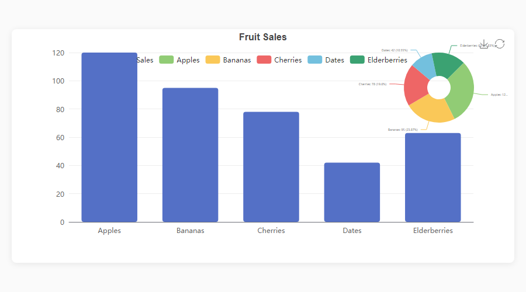</p>
</td>
<td width="50%">
<p align="center"><strong>Smooth Line</strong></p>
<p align="center"></p>
</td>
</tr>
<tr>
<td width="50%">
<p align="center"><strong>Scatter Plot</strong></p>
<p align="center"></p>
</td>
<td width="50%">
<p align="center"><strong>Grouped Bar</strong></p>
<p align="center">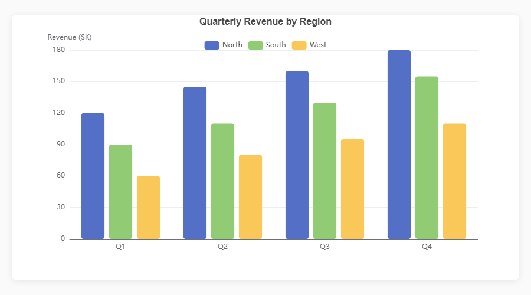</p>
</td>
</tr>
<tr>
<td width="50%">
<p align="center"><strong>Stacked Bar</strong></p>
<p align="center"></p>
</td>
<td width="50%">
<p align="center"><strong>Histogram</strong></p>
<p align="center">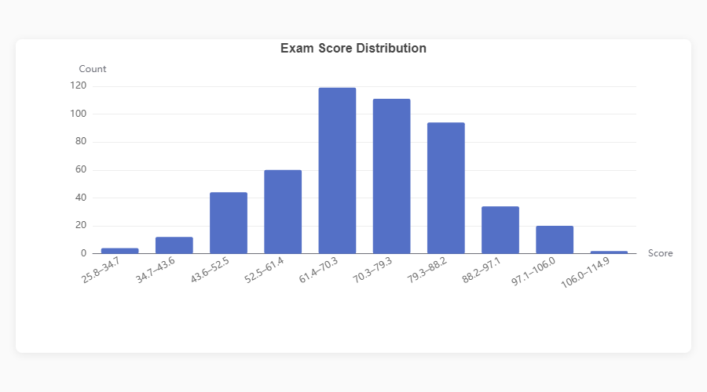</p>
</td>
</tr>
<tr>
<td width="50%">
<p align="center"><strong>Area Chart</strong></p>
<p align="center">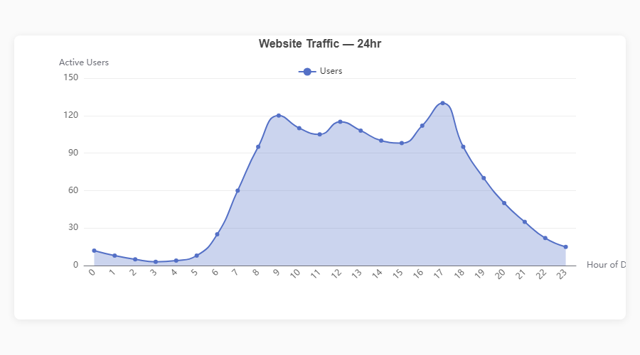</p>
</td>
<td width="50%">
<p align="center"><strong>Horizontal Bar</strong></p>
<p align="center"></p>
</td>
</tr>
<tr>
<td width="50%">
<p align="center"><strong>Dual Axis: Bar + Line</strong></p>
<p align="center"></p>
</td>
<td width="50%">
<p align="center"><strong>Gradient Bars</strong></p>
<p align="center">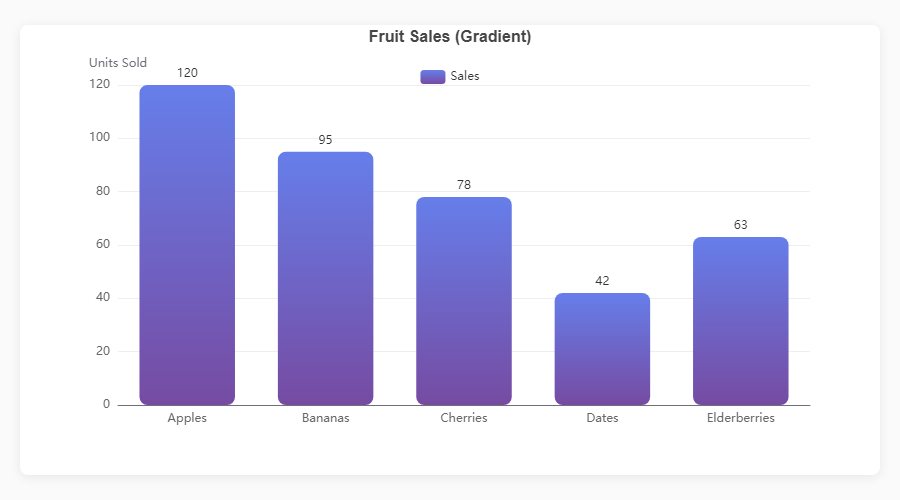</p>
</td>
</tr>
<tr>
<td width="50%">
<p align="center"><strong>Multi-Line with Area</strong></p>
<p align="center">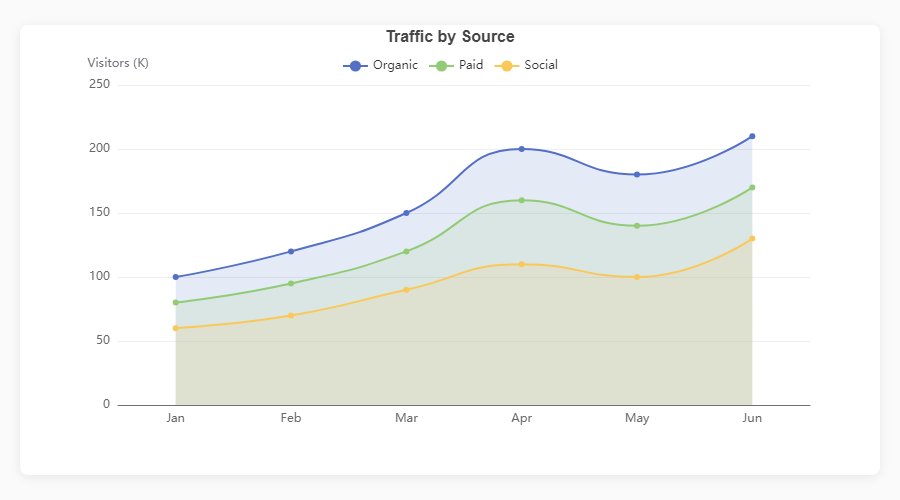</p>
</td>
<td width="50%">
<p align="center"><strong>Boxplot</strong></p>
<p align="center">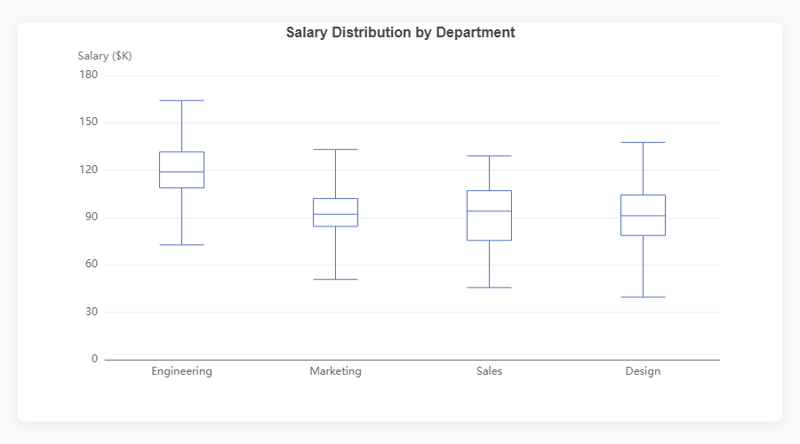</p>
</td>
</tr>
</table>

### Standalone Charts

<table>
<tr>
<td width="50%">
<p align="center"><strong>Donut Chart</strong></p>
<p align="center"></p>
</td>
<td width="50%">
<p align="center"><strong>Radar Chart</strong></p>
<p align="center"></p>
</td>
</tr>
<tr>
<td width="50%">
<p align="center"><strong>Heatmap</strong></p>
<p align="center">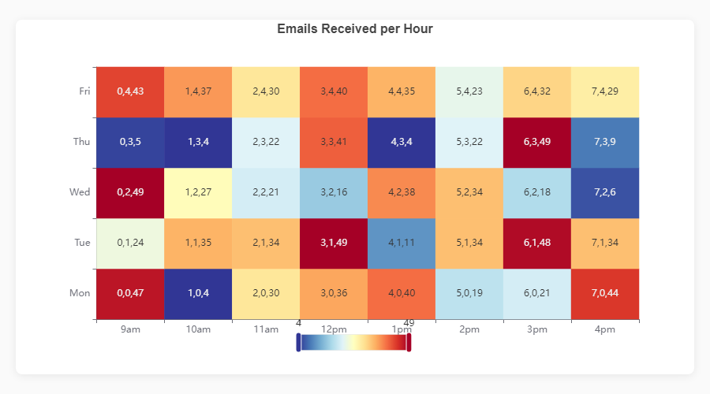</p>
</td>
<td width="50%">
<p align="center"><strong>Funnel</strong></p>
<p align="center">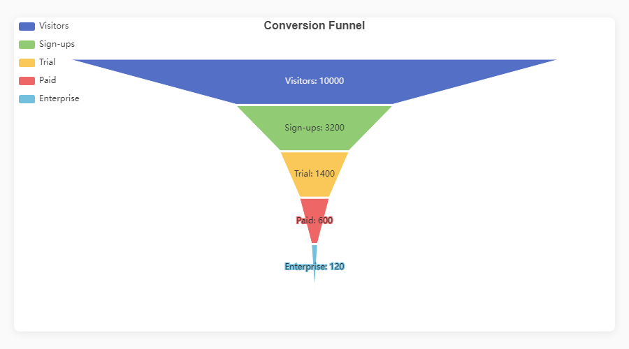</p>
</td>
</tr>
<tr>
<td width="50%">
<p align="center"><strong>Treemap</strong></p>
<p align="center">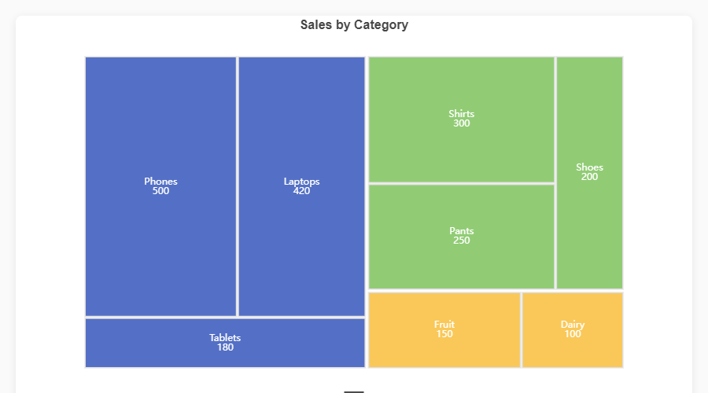</p>
</td>
<td width="50%">
<p align="center"><strong>Sankey Diagram</strong></p>
<p align="center">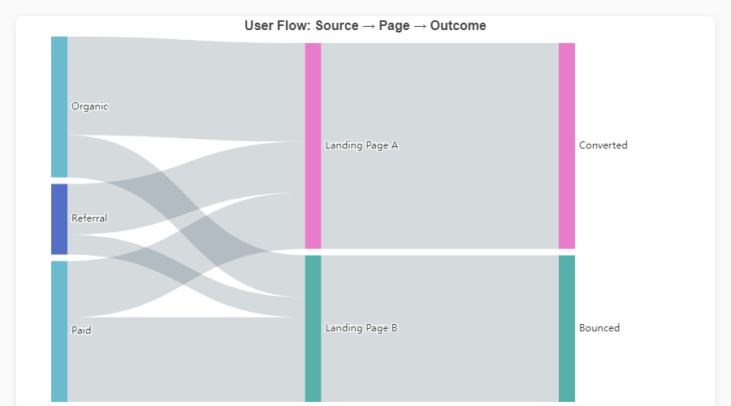</p>
</td>
</tr>
<tr>
<td width="50%">
<p align="center"><strong>Side-by-Side Pies</strong></p>
<p align="center">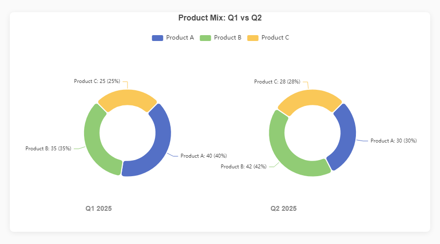</p>
</td>
<td width="50%">
<p align="center"><strong>Dark Theme</strong></p>
<p align="center"></p>
</td>
</tr>
</table>

### Composite & Dashboard Charts

<table>
<tr>
<td width="50%">
<p align="center"><strong>Bar + Pie (Dark Style)</strong></p>
<p align="center">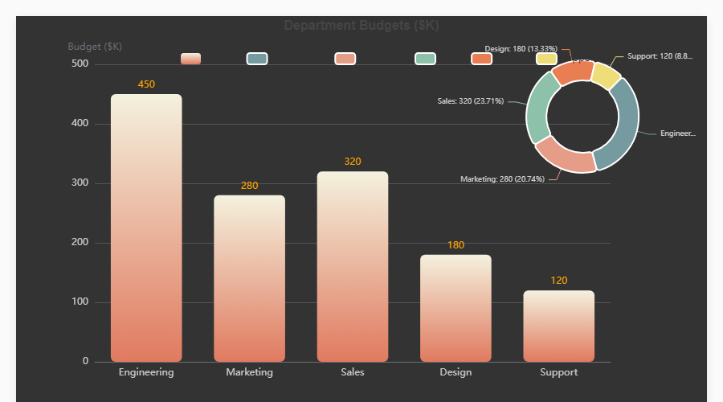</p>
</td>
<td width="50%">
<p align="center"><strong>Triple Composite</strong></p>
<p align="center"></p>
</td>
</tr>
<tr>
<td width="50%">
<p align="center"><strong>KPI Dashboard</strong></p>
<p align="center">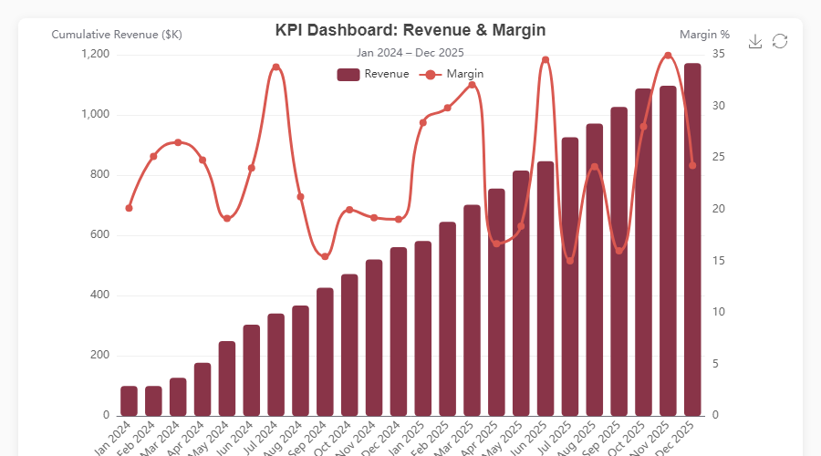</p>
</td>
<td width="50%">
<p align="center"><strong>Stacked + Trend + Pie</strong></p>
<p align="center">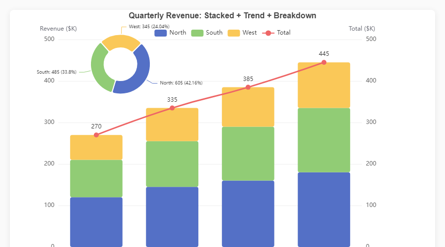</p>
</td>
</tr>
</table>

> Every chart is fully interactive — hover for tooltips, click legend items to toggle, use the toolbox to export. Open the [HTML files in assets/](assets/) for the live experience, or run `python generate_demos.py` yourself.

---

## Installation

```bash
pip install echartslib
```

Optional extras:

```bash
pip install echartslib[jupyter]     # Jupyter Notebook support
pip install echartslib[streamlit]   # Streamlit support
pip install echartslib[scipy]       # KDE density plots
pip install echartslib[all]         # Everything
```

---

## Quick Start

```python
import pandas as pd
import echartslib as ec

ec.config(engine="jupyter")  # or "python" or "streamlit"

df = pd.DataFrame({
    "Fruit": ["Apples", "Bananas", "Cherries", "Dates", "Elderberries"],
    "Sales": [120, 95, 78, 42, 63],
})

fig = ec.figure()
fig.bar(df, x="Fruit", y="Sales")
fig.title("Fruit Sales")
fig.show()
```

Three lines to go from DataFrame to interactive chart.

---

## Rendering Engines

| Engine | Use Case | Setup |
|:---|:---|:---|
| `"jupyter"` | Jupyter Notebook / JupyterLab | `pip install echartslib[jupyter]` |
| `"python"` | Standalone scripts → opens browser | No extra deps |
| `"streamlit"` | Streamlit applications | `pip install echartslib[streamlit]` |

```python
ec.config(engine="jupyter")
ec.config(engine="jupyter", adaptive="dark")   # Force dark mode
ec.config(engine="jupyter", adaptive="light")  # Force light mode
```

---

## Chart Types

### Cartesian Charts

```python
# Bar — stacked, horizontal, gradient fills
fig.bar(df, x="Month", y="Revenue", hue="Region", stack=True, gradient=True, orient="h")

# Line — smooth curves, filled areas, multi-series via hue
fig.plot(df, x="Month", y="Sales", hue="Region", smooth=True, area=True)

# Scatter — color & size encoding
fig.scatter(df, x="Height", y="Weight", color="Gender", size="Age")

# Histogram — auto-binned distribution
fig.hist(df, column="Score", bins=20)

# Boxplot — statistical summary
fig.boxplot(df, x="Department", y="Salary")

# KDE — kernel density estimation (requires scipy)
fig.kde(df, column="Score", hue="Class")
```

### Standalone Charts

```python
# Pie / Donut
fig.pie(df, names="Browser", values="Share", inner_radius="40%")

# Radar
fig.radar(indicators, data, series_names=["Warrior", "Mage", "Rogue"])

# Heatmap
fig.heatmap(df, x="Day", y="Hour", value="Count")

# Sankey
fig.sankey(df, levels=["Source", "Channel", "Outcome"], value="Users")

# Treemap
fig.treemap(df, path=["Category", "SubCategory"], value="Sales", roam=False)

# Funnel
fig.funnel(df, names="Stage", values="Count")
```

---

## Composite Charts

Overlay a pie on any cartesian chart — just pass `center` and `radius`:

```python
fig = ec.figure(height="500px", style=ec.StylePreset.DASHBOARD_DARK)
fig.bar(df, x="Department", y="Budget", gradient=True,
        gradient_colors=["#f4f1de", "#e07a5f"], labels=True, label_color="orange")
fig.pie(df, names="Department", values="Budget",
        center=["82%", "25%"], radius=["18%", "28%"])
fig.legend(top=40, left=200)
fig.margins(right=120)
fig.show()
```

Triple composite (bar + line + pie):

```python
fig = ec.figure(height="550px")
fig.bar(df, x="Month", y="Revenue", labels=True, border_radius=4)
fig.plot(df, x="Month", y="Growth", smooth=True, axis=1, line_width=3)
fig.pie(df_mix, names="Plan", values="Share",
        center=["25%", "32%"], radius=["15%", "25%"])
fig.ylabel("Revenue ($K)")
fig.ylabel_right("Growth %")
fig.legend(top=40, left=350)
fig.show()
```

---

## Dual-Axis Charts

```python
fig = ec.figure()
fig.bar(df, x="Month", y="Revenue", labels=True)
fig.plot(df, x="Month", y="GrowthRate", smooth=True, axis=1)
fig.ylabel("Revenue ($K)")
fig.ylabel_right("Growth %")
fig.legend(top=40)
fig.show()
```

---

## Timeline Animations

Animate any chart across a time dimension:

```python
fig = ec.TimelineFigure(height="500px", interval=1.5)
fig.bar(df, x="Country", y="GDP", time_col="Year", labels=True)
fig.title("GDP by Country")
fig.ylabel("GDP (Trillion USD)")
fig.legend(top=30)
fig.show()
```

---

## Style Presets

```python
fig = ec.figure(style=ec.StylePreset.CLINICAL)         # Clean clinical palette
fig = ec.figure(style=ec.StylePreset.DASHBOARD_DARK)    # Dark background
fig = ec.figure(style=ec.StylePreset.KPI_REPORT)        # Warm tones
fig = ec.figure(style=ec.StylePreset.MINIMAL)           # Minimal & simple
```

Custom palettes:

```python
fig.palette(["#667eea", "#764ba2", "#f093fb", "#f5576c", "#4facfe"])
fig.palette(ec.PALETTE_RUSTY)
fig.palette(ec.PALETTE_CLINICAL)
```

---

## Chrome Configuration

```python
fig.title("Chart Title", subtitle="Optional subtitle")
fig.xlabel("X Label", rotate=30)
fig.ylabel("Y Label")
fig.ylabel_right("Secondary Y")
fig.legend(orient="vertical", left="right", top=40)
fig.margins(left=100, right=120, top=40)
fig.datazoom(start=0, end=80)
fig.toolbox(download=True, zoom=True)
fig.grid(show=True)
fig.save(name="my_chart", fmt="png", dpi=3)
```

---

## Exporting

```python
# Standalone HTML file (fully interactive, no server needed)
fig.to_html("my_chart.html")

# Raw ECharts option dict (for debugging or custom renderers)
option = fig.to_option()
```

---

## Adaptive Dark Mode

Charts automatically adapt to the user's OS light/dark preference:

```python
ec.config(engine="jupyter", adaptive="auto")    # Auto-detect (default)
ec.config(engine="jupyter", adaptive="dark")    # Force dark
ec.config(engine="jupyter", adaptive="light")   # Force light
```

---

## Generating Showcase Images

To regenerate the screenshots shown above:

```bash
# 1. Generate the demo HTML charts
python generate_demos.py

# 2. Capture PNG screenshots (requires playwright)
pip install playwright && playwright install chromium
python capture_screenshots.py
```

---

## Contributing

Contributions are welcome! Please open an issue or PR on [GitHub](https://github.com/astrojigs/echartslib).

## License

[MIT](LICENSE) — Jigar, 2026
